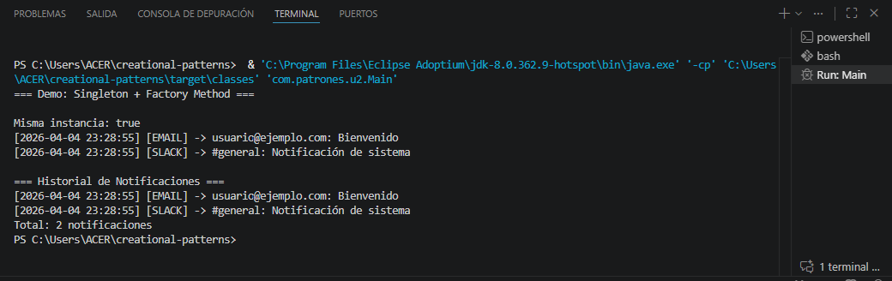

Análisis de Patrones Creacionales - Unidad 2

Estudiante: Alessandro Reyes
Institución: Universidad Francisco de Paula Santander 
Programa: Ingeniería de Sistemas 
Año: 2026 

1. Descripción del Proyecto
Este proyecto consiste en un Sistema de Gestión de Notificaciones para una aplicación de e-commerce. El sistema permite enviar mensajes a través de múltiples canales (Email, SMS, Push) manteniendo un registro centralizado y persistente de todas las actividades durante la ejecución.
2. Análisis de Patrones Implementados

A. Singleton (Variante Enum)
Problema que resuelve: La necesidad de un gestor de logs único en toda la aplicación que registre cada notificación enviada sin crear múltiples instancias que dupliquen o fragmenten la información.
Solución: Se implementó mediante un enum llamado NotificationLogger. Esta variante es considerada la mejor práctica en Java ya que garantiza que sea thread-safe por diseño de la JVM y protege contra la instanciación accidental vía reflexión.

B. Factory Method (Registro Dinámico)
Problema que resuelve: Crear distintos tipos de notificadores (Email, SMS, Push) sin que el código de negocio conozca las clases concretas, permitiendo que el sistema sea extensible.
Solución: Se utilizó una NotifierFactory con un registro dinámico basado en un Map<String, Supplier<Notifier>>. Esto aplica el Principio de Abierto/Cerrado (OCP), ya que permite registrar nuevos canales de notificación (como Slack) en tiempo de ejecución sin modificar el código interno de la fábrica.

3. Prerrequisitos de Ejecución
Java JDK: 17 o superior.
Apache Maven: 3.8 o superior.
Git: Para el control de versiones.

4. Instrucciones de Ejecución
Para compilar y ejecutar la demostración del sistema, usa los siguientes comandos en la terminal:
Compilar el proyecto:
Bash
mvn compile
Ejecutar la clase Main:
Bash
mvn exec:java -Dexec.mainClass="com.patrones.u2.Main"

5. Captura de la Salida (Demo)

